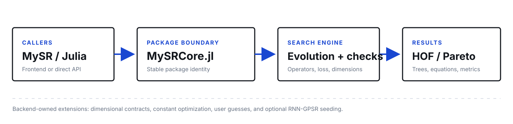

<div align="center">
  
  <p><strong>A Julia search core for interpretable symbolic regression.</strong><br>
  Evolutionary expression search, dimensional contracts, and Pareto frontiers for MySR.</p>
  <p>
    <a href="https://github.com/TAO-MINGYU/MySRCore.jl/releases"></a>
    <a href="https://github.com/TAO-MINGYU/MySRCore.jl/blob/main/LICENSE"></a>
    <a href="https://github.com/TAO-MINGYU/MySRCore.jl"></a>
  </p>
  <p>
    <a href="#quickstart">Quickstart</a>&nbsp;&middot;&nbsp;
    <a href="#capabilities">Capabilities</a>&nbsp;&middot;&nbsp;
    <a href="#architecture">Architecture</a>&nbsp;&middot;&nbsp;
    <a href="#development">Development</a>
  </p>
</div>

> MySRCore.jl is an independent fork derived from SymbolicRegression.jl. It is not an official SymbolicRegression.jl release.

## Overview

MySRCore.jl is the Julia search core behind [MySR](https://github.com/TAO-MINGYU/MySR), a general-purpose symbolic regression project. It searches over mathematical expressions, evaluates their loss, optimizes constants, applies structural and dimensional checks, and maintains an inspectable Hall of Fame (HOF) / Pareto frontier.

The package keeps the low-level Julia interface available for direct research use while giving MySR a stable backend boundary. Python users normally encounter MySRCore through MySR and Julia users can call the core directly.

## Why MySRCore?

- **A focused search engine**: configure operators, populations, evolution budgets, and parallelism at the Julia layer.
- **Inspectable equations**: retain expression trees, losses, complexity, and Pareto-dominating candidates instead of returning only one opaque model.
- **Physical contracts**: use empirical, semi-theoretical, or theoretical policies with explicit input and output dimensions.
- **A stable product boundary**: connect the MySR Python frontend to a package whose public identity is `MySRCore`.

## Installation

Install the pinned release directly from GitHub:

```julia
using Pkg
Pkg.add(url="https://github.com/TAO-MINGYU/MySRCore.jl", rev="v1.1.3")
using MySRCore
```

MySR installs the compatible MySRCore release automatically through JuliaPkg. Direct Julia users only need this repository when they want to work with the backend API itself or develop the two repositories together.

## Quickstart

The low-level interface accepts column-major data with shape `features x rows`:

```julia
using MySRCore

X = randn(Float32, 2, 100)
y = 2 * cos.(X[2, :]) + X[1, :] .^ 2 .- 2

options = Options(
    binary_operators=[+, *, /, -],
    unary_operators=[cos, exp],
    populations=20,
)

hall_of_fame = equation_search(
    X,
    y;
    niterations=40,
    options=options,
    parallelism=:multithreading,
)

dominating = calculate_pareto_frontier(hall_of_fame)

for member in dominating
    complexity = compute_complexity(member, options)
    equation = string_tree(member.tree, options)
    println("complexity=$(complexity)\tloss=$(member.loss)\t$(equation)")
end
```

Each `PopMember` stores an expression tree and its loss. The Pareto frontier provides a compact view of the accuracy-complexity tradeoff, and the expression tree can be evaluated directly:

```julia
tree = dominating[end].tree
prediction, did_succeed = eval_tree_array(tree, X, options)
```

## Capabilities

| Area | What MySRCore provides |
| --- | --- |
| Expression search | Evolutionary symbolic regression with configurable operators and search budgets. |
| Evaluation | Fast expression evaluation with explicit success flags for invalid numerical results. |
| Complexity control | Complexity scoring and Pareto-frontier maintenance for interpretable model selection. |
| Constant optimization | Backend-owned optimization of numeric constants in candidate expressions. |
| Dimensional analysis | Static dimension inference and hard candidate checks for constrained formula types. |
| Initialization | User guesses and optional RNN-GPSR proposal callbacks before formal search. |
| Julia integration | Direct Julia API plus compatibility with the MySR Python frontend through JuliaPkg. |

## Dimensional workflows

For dimension-aware search, pass seven-component exponent vectors in the order length, mass, time, current, temperature, luminosity, and amount. The policy is selected by `formula_type`:

- `:empirical` ignores dimensions.
- `:semi_theoretical` requires dimension metadata and permits a single dimensionful outer coefficient after the internal expression is validated.
- `:theoretical` requires dimension metadata and validates the final expression against the target dimension.

```julia
using MySRCore

X = reshape(Float64[1, 2, 3, 4], 1, :)
y = 3 .* vec(X) .^ 2

options = Options(
    formula_type=:theoretical,
    binary_operators=[+, *, /, -],
    default_plugins=(),
)

hall_of_fame = equation_search(
    X,
    y;
    options=options,
    niterations=20,
    variable_names=["x1"],
    X_dimensions=[[1, 0, 0, 0, 0, 0, 0]],
    y_dimensions=[2, 0, 0, 0, 0, 0, 0],
    parallelism=:serial,
)
```

These checks are backend contracts. They are also used when MySR's Python feature-engineering and RNN-GPSR layers propose candidates for the formal search.

## MySR integration

The two repositories have deliberately separate responsibilities:

| Repository | Public role |
| --- | --- |
| [MySR](https://github.com/TAO-MINGYU/MySR) | Python frontend, data preparation, feature proposals, prediction replay, and exports. |
| **MySRCore.jl** | Julia expression search, evaluation, dimensional legality, constant optimization, and HOF maintenance. |

Use MySR when you want a Python and scikit-learn style workflow. Use MySRCore directly when you need low-level Julia control, custom search integration, or direct access to expression and search internals.

## Architecture

<div align="center">
  
</div>

MySRCore keeps the retained SymbolicRegression.jl engine behind the package identity `MySRCore` and re-exports its public search interface. The backend owns the expression search and candidate legality; the MySR frontend owns Python-facing orchestration and feature preparation.

## Relationship to SymbolicRegression.jl

MySRCore is derived from [SymbolicRegression.jl](https://github.com/astroautomata/SymbolicRegression.jl), version 2.0.0-beta.8 at commit `35d45fd625dc8df0067df60c72b615d83518ed44`. Upstream attribution and the independent changes are recorded in [NOTICE](https://github.com/TAO-MINGYU/MySRCore.jl/blob/main/NOTICE), [VENDORING.md](https://github.com/TAO-MINGYU/MySRCore.jl/blob/main/VENDORING.md), and [FORK_CHANGES.md](https://github.com/TAO-MINGYU/MySRCore.jl/blob/main/FORK_CHANGES.md).

MySRCore preserves the upstream algorithmic lineage while maintaining its own package identity, release version, dimensional contracts, and MySR bridge. It does not represent the upstream project's official release channel.

## Development

Clone the backend and load it as a Julia development package:

```bash
git clone https://github.com/TAO-MINGYU/MySRCore.jl.git
cd MySRCore.jl
julia --project=. -e 'using Pkg; Pkg.instantiate(); Pkg.test()'
```

For joint frontend/backend development, keep the repositories as siblings:

```text
/home/taomingyu/MySR_Dev/
|-- MySR/          # Python frontend
`-- MySRCore.jl/  # Julia search core
```

The Python frontend can temporarily point JuliaPkg at this local checkout during development. The released MySR configuration remains pinned to the published MySRCore tag.

## Status

MySRCore.jl 1.1.3 is research software under active development. The core search path and package-contract tests are maintained; dimensional workflows, feature engineering, and RNN-GPSR should still be evaluated against the intended dataset and search budget before being used for scientific conclusions.

## License

MySRCore.jl is released under the [Apache License 2.0](https://github.com/TAO-MINGYU/MySRCore.jl/blob/main/LICENSE). Upstream copyright and attribution are retained.
